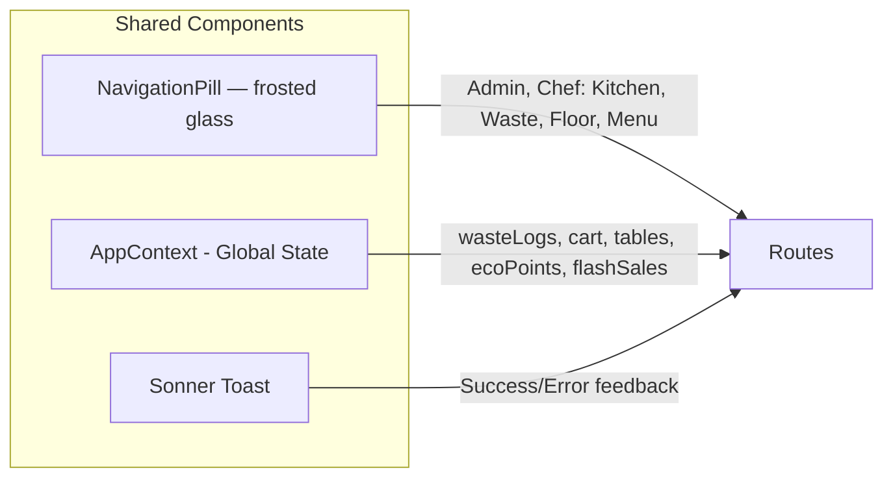

# DineFlow — Improved UI Wireframes (v2)

> Redesigned for visual consistency, premium aesthetics, and better UX hierarchy.
> All screens now use the DineFlow design token system throughout.

---

## Design System Reference

| Token | Value | Usage |
|---|---|---|
| `accent` | Forest green (#2D6A4F) | Primary CTAs, active states |
| `mint` | Soft green | Success, eco metrics |
| `coral` | Warm red-orange | Warnings, danger, preparing |
| `amber` | Warm orange | Low stock, neutral alerts |
| `steel` | Muted blue | Info, pre-order states |
| `muted` | Off-white grey | Backgrounds, inactive |

---

## Screen Map (Navigation / Routing)

```mermaid
flowchart TD
    A(["/ Landing Page"]) --> |Select Admin| B(["/admin  Admin Dashboard"])
    A --> |Select Chef| C(["/kitchen  Kitchen Panel"])
    A --> |Select Waiter| D(["/floor  Floor Map"])
    A --> |Select Customer| E(["/menu  Customer Menu"])
    B -. sidebar .--> D
    B -. sidebar .--> C
    B -. "view: waste" .--> F(["/waste  Waste Management"])
    C -. nav pill .--> F
    F -. nav pill .--> C
    style A fill:#e8f5e9,stroke:#2D6A4F
    style B fill:#f3e5f5,stroke:#7B1FA2
    style C fill:#fff3e0,stroke:#E65100
    style D fill:#e3f2fd,stroke:#1565C0
    style E fill:#e8f5e9,stroke:#2D6A4F
    style F fill:#fce4ec,stroke:#C62828
```

---

## Screen 1 — Landing Page (`/`) ✨ REDESIGNED

**Hero section + role selection. Brand presence elevated.**

```
┌─────────────────────────────────────────────────────────┐
│  [animated leaf blobs — pure CSS, subtle bg motion]     │
│                                                         │
│  ┌── HERO SECTION ──────────────────────────────────┐   │
│  │                  🍃                              │   │
│  │  ┌──────────────────────────────────────┐        │   │
│  │  │  DineFlow  [gradient: forest→mint]   │        │   │
│  │  └──────────────────────────────────────┘        │   │
│  │  The Circular Economy Restaurant Platform        │   │
│  │  from procurement · to plate · to impact         │   │
│  │                                                  │   │
│  │  [🌿 Powering zero-waste dining since 2025]  ←badge│ │
│  └──────────────────────────────────────────────────┘   │
│                                                         │
│  ┌── ROLE CARDS GRID (2×2) ────────────────────────┐    │
│  │  ┌──────────────────────┐  ┌───────────────────┐ │   │
│  │  │ [accent glow on hover│  │ [coral glow]      │ │   │
│  │  │ 📊 Admin Dashboard   │  │ 🍳 Kitchen Panel  │ │   │
│  │  │ Strategy & KPIs      │  │ AI prep & orders  │ │   │
│  │  │ [→ Enter]            │  │ [→ Enter]         │ │   │
│  │  └──────────────────────┘  └───────────────────┘ │   │
│  │  ┌──────────────────────┐  ┌───────────────────┐ │   │
│  │  │ [amber glow]         │  │ [mint glow]       │ │   │
│  │  │ 🗺 Floor Map        │  │ 🍽 Customer Menu  │ │   │
│  │  │ Tables & alerts      │  │ Mobile ordering   │ │   │
│  │  │ [→ Enter]            │  │ [→ Enter]         │ │   │
│  │  └──────────────────────┘  └───────────────────┘ │   │
│  └─────────────────────────────────────────────────┘    │
│                                                         │
│  ─── How it works ────────────────────────────────────  │
│  [📦 Procurement] → [📋 Prep] → [🍽 Service] → [♻ Waste]│
└─────────────────────────────────────────────────────────┘
```

**UX Improvements:**
- Animated leaf blobs give life to the background without distraction
- Gradient headline creates a strong brand impression
- Role cards have per-theme color glow on hover (no jarring solid colors)
- "How it works" pipeline row contextualizes the platform

---

## Screen 2 — Admin Dashboard (`/admin`) ✨ IMPROVED

**Fixed sidebar with logo section + role badge. Active state uses full-width accent band.**

```
┌────────────────┬──────────────────────────────────────────────┐
│ SIDEBAR        │  MAIN CONTENT                                │
│ ─────────────  │  ──────────────────────────────────────────  │
│ 🍃 DineFlow    │  [Breadcrumb: Admin › Dashboard]   [Admin 🛡]│
│  ─────────     │                                              │
│ ▌📊 Dashboard  │  ← active: left accent bar + icon tint      │
│  🚚 Suppliers  │                                              │
│  🗺 Floor Map  │                                              │
│  🍳 Kitchen   │                                              │
│  📦 Inventory  │                                              │
│  ♻️ Waste Log  │                                              │
│  📈 Analytics  │                                              │
│  ⚙️ Settings   │                                              │
│  ─────────     │                                              │
│ [👤] Admin     │                                              │
│ [🚪] Logout    │                                              │
└────────────────┴──────────────────────────────────────────────┘
```

### 2a — Dashboard View
```
┌── Page Header ──────────────────────────────────────────┐
│  Strategy Dashboard          Sat, 28 Mar 2026  [Admin🛡] │
└──────────────────────────────────────────────────────────┘

┌── Stats Grid (3 cols, each with left color stripe) ─────┐
│ ▌(green) Revenue Recovered  ┃ ▌(mint) CO₂ Saved         │
│   ₹12,400  ↑ +18%           ┃   340kg = 12 trees        │
│─────────────────────────────┃──────────────────────────  │
│ ▌(accent) Inventory Eff.    ┃                            │
│   87%   ○ [circular prog]   ┃                            │
└──────────────────────────────────────────────────────────┘

┌── Chart (3/5) ──────────────┐  ┌── AI Insights (2/5) ──┐
│  Daily Sales vs Waste Cost  │  │  🔮 Biryani demand +35% │
│  [Recharts LineChart]       │  │     [Act Now]          │
│                             │  │  ⚠️ Paneer 2d to expiry │
│                             │  │     [Act Now]          │
│                             │  │  ✅ Tomato saved ₹2,300 │
│                             │  │     [View]             │
└─────────────────────────────┘  └────────────────────────┘
```

### 2b — Suppliers / 2c — Inventory / 2d — Settings
*(Functionally unchanged — visual improvements to headers and status badges)*

---

## Screen 3 — Kitchen Panel (`/kitchen`) ✨ REDESIGNED

**Full token system migration. Premium card design with consistent colors.**

```
┌── STICKY HEADER ────────────────────────────────────────┐
│ [🍳] Kitchen Panel    12:34:56    [🍽 LUNCH SERVICE]     │
│                      (font-mono)  (badge-pill bg-mint/15)│
└──────────────────────────────────────────────────────────┘

┌── SUMMARY BAR (4 equal pills, full-width) ──────────────┐
│ [coral bg] 🔥 Preparing  │ [muted] 📋 Queued            │
│     N                    │    N                         │
│ [mint bg]  ✅ Done Today │ [accent/10] ⚡ Flash Sales   │
│     N                    │    N                         │
└──────────────────────────────────────────────────────────┘

┌── LEFT (Tabbed) ───────────────────┐ ┌── RIGHT (280px) ─┐
│ [bg-muted pill tabs]               │ │ ⚡ Flash Sales    │
│ ┌────────────────┬───────────────┐ │ │ (accent/10 hdr)  │
│ │ 📋 Live Orders │ ✅ Prep Sheet │ │ │ ┌──────────────┐ │
│ │    [N badge]   │   [92% AI]    │ │ │ │ Item OLD→NEW │ │
│ └────────────────┴───────────────┘ │ │ │ [ACTIVATE]   │ │
│                                    │ │ └──────────────┘ │
│  TAB: Live Orders                  │ │                  │
│  🔥 Now Preparing                  │ │ 💡 AI Tip        │
│  ┌─ card-dineflow border-coral/40 ─┐│ │ (amber/5 bg)    │
│  │ ORD-001  12:30  ● Preparing    ││ └──────────────────┘
│  │ Chicken Biryani      [✓ Done]  ││
│  └────────────────────────────────┘│
│                                    │
│  📋 Up Next                        │
│  ┌─ card-dineflow border-border ───┐│
│  │ ORD-002  12:28  ○ Queued       ││
│  │ Paneer Tikka        [Prepare]  ││
│  └────────────────────────────────┘│
│                                    │
│  TAB: Prep Sheet                   │
│  ┌─ card-dineflow ────────────────┐ │
│  │ 🍛  Biryani         [Event🏏] │ │
│  │ ████████░░  72%               │ │
│  │ Prepped: [−]  14  [+]         │ │
│  │ ⚠️ Paneer exp.  [Flash Sale?] │ │
│  └────────────────────────────────┘ │
└─────────────────────────────────────┘
              [NavigationPill — frosted glass]
```

**Token Migration Map (Kitchen Panel):**
| Old class | New token class |
|---|---|
| `bg-gray-50` | `bg-background` |
| `bg-white` | `bg-card` |
| `border-gray-200` | `border-border` |
| `text-gray-900` | `text-foreground` |
| `text-gray-400` | `text-muted-foreground` |
| `bg-orange-100 text-orange-600` | `bg-coral/15 text-coral` |
| `bg-green-100 text-green-700` | `bg-mint/15 text-mint` |
| `bg-gray-100 text-gray-500` | `bg-muted text-muted-foreground` |
| `border-orange-400` | `border-coral/50` |

---

## Screen 4 — Waste Management (`/waste`) ✨ IMPROVED

**Stats cards get color stripes. Reason chips get proper active toggle style.**

```
┌── HEADER ──────────────────── [♻️ Waste Management] ────┐
│  N entries today                              [Admin 🛡] │
└──────────────────────────────────────────────────────────┘

┌── STATS ROW (3 cols, left stripe) ──────────────────────┐
│ ▌(coral) 🗑 Total Logs  │ ▌(amber) ⚠ Top Reason        │
│       N                 │  Over-prepped                 │
│─────────────────────────┼──────────────────────────────  │
│ ▌(mint) 📉 Avg/Day      │                               │
│       N                 │                               │
└──────────────────────────────────────────────────────────┘

┌── LOG FORM ─────────────────┐  ┌── WASTE FEED ──────────┐
│ 📋 Log New Waste Entry      │  │  Live Feed  [N records] │
│                             │  │  ─────────────────────  │
│ Item:   [Select ▾]          │  │  🗑 Tomato   12:40      │
│ Qty:    [____] [Unit ▾]     │  │    2kg · Over-prepped  │
│                             │  │                        │
│ Reason: (chip toggles)      │  │  🗑 Paneer   11:22      │
│ [📦 Over-prepped active]    │  │    1.5kg · Expired     │
│ [⏰ Expired]                │  │                        │
│ [🍽 Plate return]           │  │  (scrollable)           │
│ [💥 Damaged]                │  │                        │
│                             │  │                        │
│ [✓ Log Waste Entry]         │  │                        │
└─────────────────────────────┘  └────────────────────────┘
```

---

## Screen 5 — Floor Map (`/floor`) ✨ IMPROVED

**Rebalanced 2-section header. Table cards gain capacity pill. Alert panel retains count.**

```
┌── HEADER ──────────────────────────────────────────────┐
│  🍽️ Floor Manager  [Lunch Service badge]  [+ New Order]│
│  ← left group ───────────────────────── right button → │
└─────────────────────────────────────────────────────────┘

┌── TABLE GRID (70%) ──────────────────┐  ┌── ALERTS ────┐
│  ┌──────┐ ┌──────┐ ┌──────┐ ...      │  │ Live Alerts  │
│  │  T1  │ │  T2  │ │  T3  │          │  │   (N) 🟢     │
│  │ mint │ │ amber│ │ steel│          │  │              │
│  │ Avail│ │45min │ │ETA3m │          │  │ ┌── Alert ──┐ │
│  │ [4👤]│ │ [2👤]│ │ [6👤]│          │  │ │ TITLE [✕] │ │
│  └──────┘ └──────┘ └──────┘          │  │ │ Message   │ │
│  ...more rows...                     │  │ │ [Action]  │ │
│                                      │  │ └───────────┘ │
│  ── Legend ──────────────────────    │  │               │
│  ● Available  ● Occupied             │  │ [All Available│
│  ● Pre-order  ● Reserved  ● Cleaning │  │ [New Service] │
└──────────────────────────────────────┘  └───────────────┘

Bottom Sheet (on table tap):
┌──────────── Table T1 ──────────────────────────────────┐
│  ────── (drag indicator)                               │
│  ┌── 2 col grid ──────────────────────────────────┐   │
│  │ T1  ·  4 seats         Guest: Priya M.          │   │
│  │ Status: Occupied        Time: 45 min (Course 2)  │   │
│  └─────────────────────────────────────────────────┘   │
│  Pre-order items: Biryani, Raita                       │
│  ─────────────────────────────────────────────────     │
│  [Mark Available — btn-primary]  [⚠️ Flag Issue — btn-danger] │
└─────────────────────────────────────────────────────────┘
```

---

## Screen 6 — Customer Menu (`/menu`) ✨ IMPROVED

**Filter chips get active state. Eco badges are color-coded. FAB is gradient-primary.**

```
┌── STICKY HEADER (430px max) ─────────────────────────┐
│  🍃 DineFlow                   🌿 {eco_points} pts   │
│  The Green Table                                      │
└───────────────────────────────────────────────────────┘

│  ♻️ Zero-Waste Flash Deals — Limited Time!            │
│  ┌─────────────────────────── shimmer on load ──────┐ │
│  │ [gradient card] 🧀 Paneer  │ [gradient] 🍮 Gulab │ │
│  │ ~~₹180~~ ₹99               │ ~~₹80~~ ₹45         │ │
│  │ ⏰ 12:45  🌿 Saves CO₂     │ ⏰ 09:30             │ │
│  │ [Add to Order]             │ [Add to Order]      │ │
│  └─────────────────────────────────────────────────┘  │
│                                                       │
│  Filter: [All active→accent] [Veg] [Non-Veg] [Flash] │
│                (chip toggles with bg-accent active)   │
│                                                       │
│  📂 Starters                                          │
│  ┌──────────────────────────────────────────────┐     │
│  │ [img] Item Name       🌿 [ecoScore mint/amber] ₹150│
│  │       Description             [+]            │     │
│  └──────────────────────────────────────────────┘     │
│                                                       │
│  [🛒 2 items  ₹320   View Order →]  ← gradient FAB   │
└───────────────────────────────────────────────────────┘
```

---

## Global Shared Components ✨ IMPROVED

### NavigationPill — Frosted Glass

```
Old: solid white background, flat
New: backdrop-blur-md bg-card/80 — frosted glass effect
     active route: colored dot indicator below icon
```



| Component | Description |
|---|---|
| `NavigationPill` | Frosted glass floating nav. Role-filtered. Active dot indicator. |
| `AppContext` | Global state: `userRole`, `cart`, `wasteLogs`, `tablesState`, `ecoPoints`, `flashSaleActive` |
| `ProtectedRoute` | Wraps pages and redirects if user role doesn't have access |
| `Sonner Toast` | Lightweight toast notifications throughout the app |
